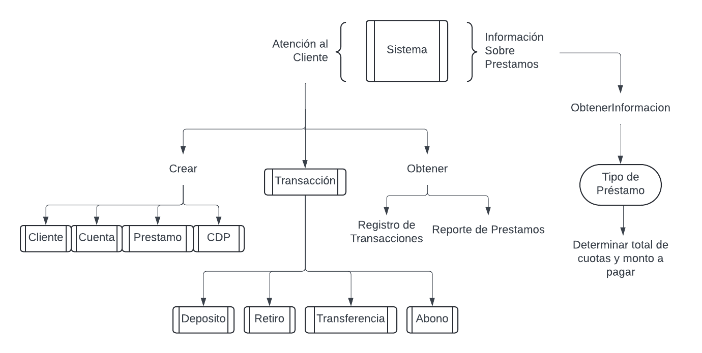

# IE-0217 Proyecto Final
Repositorio de desarrollo del proyecto final del curso de Estructuras Abstractas de Datos y Algoritmos para Ingeniería, UCR

### Desarrolladores:
1. Oscar Porras Silesky, C16042
2. Antony Brenes Rodriguez, C11238
3. Kristhel Quesada López, C06153

### Cronograma de Actividades
Para la administración de las tareas, se plantea un cronograma de actividades. Para ello, puede consultarlo en el siguiente obtenido de [enlace](https://docs.google.com/spreadsheets/d/1mPE6jiAj3QWYv3zHUNRwJNxZAZ0zDU7AJWiWEDiOWts/edit#gid=884262323).

### Indice
1. [Descripción General](#descripcion-general)
2. [Investigación Previa](#investigacion-previa)

    - [Operaciones Bancarias](#operaciones-bancarias-y-sus-funciones)
    - [Préstamos e Intereses](prestamos-y-tipos-de-interes)
    - [Tipos de Cambio](#tipos-de-cambio)

3. [Descripción de Diseño](#descripcion-de-diseño)
    - [Diseño de la Base de Datos](#diseño-de-la-base-de-datos)
    - [Diseño del Programa](#diseño-del-programa)

<!-- Inicio del Contenido -->
## Descripción General
El siguiente proyecto pretende implementar un diseño que cumpla con los siguientes objetivos:

1. Crear una sistema de gestion bancaria enfocada al uso por parte de los __agentes de dicha institucion__ a traves de ventanilla.
2. El sistema debe ser capaz de soportar dos modos de operacion: _atencion al cliente_ y _obtener informacion sobre prestamos (pesonales, prendario e hipotecarios)_.
3. En el area de atención al cliente, el sistema debe:
    - Poder agregar un nuevo cliente, agregar cuenta (colones o dólares) al cliente (máximo 1 por moneda), creación de préstamo o creación de Certificados de Depósito (CDP).
    - Además, debe poder permitir transacciones como depósitos, retiros, transferencias y abonos a préstamos entre cuentas personales o de terceros, siempre y cuando sea entre cuentas pertenecientes a la misma entidad bancaria.
    - Finalmente, el sistema debe ser capaz de entregar reportes como lo son: Registro de transacciones y Reporte de Préstamos (tabla de amortizacion).
4. El sistema debe ser capaz de gestionar la información requerida mediante bases de datos SQL.
5. La implementación y desarrollo del problema a resolver debe ser realizado mediante el uso de C++ utilizando el paradigma de programación de Programación Orientada a Objetos, al igual que el uso de estructuras, defines, o enumeraciones.
6. Asimismo, se solicita que la documentación del mismo sea implementada correctamente y utilizada en conjunto con el generador de Doxygen.

 

## Investigación Previa

<!-- Investigacion referente a conceptos del proceso bancario -->
### Operaciones bancarias y sus funciones
1. __Transacción:__  Al definir las operaciones bancarias, es importante saber el significado de una transacción. Una transacción es cualquier entrada o salida de dinero de una cuenta de un cliente de una entidad bancaria. Entre las operaciones bancarias que se realizan en ventanilla y algunos beneficios bancarios a los cuales los clientes pueden estar subscritos con sus cuentas, se describen los siguientes:

2. __Depósito:__ Un depósito es un proceso bancario donde un cliente puede realizar un ingreso manual de dinero a una cuenta de un cliente de un banco. Este método de transacción se puede efectuar de forma electrónica a través de un sistema. Para este tipo de transacción no es necesario que el cliente posea una cuenta bancaria a su nombre debido a que solo ocupa dinero en efectivo para llevar a cabo dicha acción.

Para realizar este tipo de transacción, el cliente debe brindar al sistema los siguientes datos para que se realice correctamente:

- Número de cuenta a la que se desea hacer el depósito.
- Número de cédula y nombre de la persona de quién realiza el depósito.
- Nombre de la persona que recibirá el dinero. 
- El tipo de moneda.
- Monto que el cliente desea depositar.
- Concepto y motivo que corresponde al detalle de la transacción.

 En el programa, la funcionalidad de depósito es esencial ya que permite la transacción de dinero a una cuenta de un cliente. Para llevar a cabo esto el sistema procesa y registra el ingreso de fondos a la cuenta que se desea depositar el dinero, verificando que el monto sea válido y sumándolo al monto actual de la cuenta del cliente. El depósito se registra en la base de datos del sistema, incluyendo detalles como el ID de la cuenta, el monto depositado y la fecha de la transacción.

3. __Retiro:__ Un retiro es una operación bancaria donde un cliente puede realizar una extracción de dinero de su propia cuenta bancaria. Esta transacción se puede realizar mediante un sistema bancario y para llevarla a cabo es necesario que el cliente posea una cuenta registrada, de lo contrario no se podría efectuar.

Para realizar un retiro de dinero, el cliente debe brindar al sistema los siguientes datos para que se realice correctamente:

- Número de cuenta a la que se desea hacer la extracción de dinero.
- Número de cédula y nombre de la persona de quién realiza la transacción y dueña de la cuenta.
- Monto que el cliente desee extraer.

 En el programa, la funcionalidad de retiro permite la resta de dinero a una cuenta del cliente. Para llevar a cabo esto el sistema valida que hayan fondos en la cuenta y procesa y registra el retiro de fondos de la cuenta que se desea extraer el dinero, verificando que el monto sea válido y restándoselo al monto actual de la cuenta del cliente. El retiro se registra en la base de datos del sistema, incluyendo detalles como el ID de la cuenta, el monto retirado y la fecha de la transacción.

4. __Transferencias entre mismos clientes:__ Una transferencia entre mismos clientes es un método bancario rápido que posibilita a un emisor el paso de dinero desde su cuenta bancaria a otra cuenta de otro cliente. Este proceso se puede realizar de forma digital a través de un sistema bancario. La ventaja de este tipo de transacción es que permite transferir dinero ya sea de una cuenta en colones o dólares a otra cuenta de la misma o diferente moneda. En cuyo caso que se realice una tranferencia entre cuentas de diferente moneda se debe de aplicar el tipo de cambio de moneda correspondiente. 

Para realizar una transferencia bancaria, el cliente ocupa proporcionar al sistema los siguientes datos para que el proceso se realice efectivamente: 

- Número de cuenta a la que se desea hacer la transferencia.
- Número de cédula y nombre de la persona de quién realiza la transferencia.
- Nombre de la persona que recibirá el dinero. 
- Monto que el cliente desee transferir.
- Concepto y motivo que corresponde al detalle de la transacción.
- El tipo de moneda.

En el programa, la funcionalidad de transferencias bancarias son importantes ya que permite la transacción de dinero a una cuenta de un cliente a otra. Para llevar a cabo este método el sistema verifica que la cuenta de origen posea fondos suficientes y luego se le deben proporcionar los datos de la transacción para poder validar la operación, despúes de este paso el sistema rebaja el dinero de la cuenta de origen y la suma al monto actual de la cuenta destino.

5. __Abonos a prestamos propios o de terceros:__ En el contexto de abonar a un préstamo, los abonos son pagos extraordinarios que un cliente realiza para reducir la vida del préstamo o la cuota mensual. Para realizar esta transacción, no es necesario que el cliente tenga una cuenta bancaria o un préstamo como tal con la entidad bancaria. 

Para realizar un abono a un préstamo, el cliente ocupa proporcionar al sistema los siguientes datos para que el proceso se realice efectivamente: 

- Número de cédula y nombre de la persona de quién realiza la transacción.
- Nombre y número de cédula de la persona asociada al préstamo. 
- Monto que el cliente desea abonar.

En el programa, la funcionalidad de abonar préstamos, el sistema valida la información del préstamo y del cliente, luego procesa los detalles de la transacción financiera y actualiza en tiempo real el saldo del préstamo y otros registros relevantes. Despúes de que la transacción haya sido efectuada el sistema generará de manera automática las confirmaciones y recibos para el cliente con los detalles del abono.

6. __Certificado de deposito a plazo:__ Un certificado de depósito (CDP) es un producto financiero ofrecido por los bancos donde una persona deposita una cantidad específica de dinero en una cuenta de ahorro por un período de tiempo acordado, que puede variar desde unos pocos meses hasta varios años. Durante este período, el banco paga intereses sobre el dinero depositado. Los CDP suelen ofrecer tasas de interés más altas que las cuentas de ahorro estándar, pero a cambio, el dinero no se puede retirar hasta que el plazo del CDP haya vencido sin incurrir en penalizaciones.

En el programa, los clientes pueden abrir un CDP seleccionando el monto y el plazo deseado. El sistema calcula automáticamente los intereses y gestiona las restricciones de retiro durante el período. Al vencimiento, el cliente puede retirar el dinero con los intereses o renovar el CD. Es una forma segura y rentable de ahorrar a largo plazo.

 

### Préstamos y tipos de interés
Un préstamo, bajo el contexto del proyecto, se define como el proceso mediante el cual una entidad bancaria presta y entrega de un monto completo de dinero que el cliente solicite, todo a cambio de un compromiso por parte del cliente de delvolver el dinero solicitado a cambio de pagos de mensuales de menor cantidad (cuotas) a un plazo acordado entre el cliente y el banco, hasta que complete la cantidad solicitada mas intereses.

Ahora, estos intereses pueden ser fijos o pueden ser variables de tal manera que, en Costa Rica, dicha variación esta sujeta a la Tasa Basica Pasiva adicional a un margen adicional que define la entidad bancaria. Tambien, se dice que para acceder a ello, el cliente puede tener máximo hasta el 50\% de su salario neto libre para préstamos; por tanto, para acceder a un tipo de crédito debe disponerse de una capacidad de pago tal, que la cuota a pagar mensualmente, sea menor al 50\% y se compruebe que que el salario neto menos gastos de vida es considerablemente mayor a la cuota a pagar. Adicionalmente, las entidades bancarias pueden emitir diferentes tipos de préstamos, entre ellos, se destacan los siguientes:

#### A. __Préstamo Personal__
Un prestamo personal pueden ser solicitados para una amplia variedad de fines personales, como consolidar deudas, cubrir gastos médicos, financiar viajes, etc. Este se carcateriza por:

- Para solicitarlos usualmente no se requiere de una garantia adicional pero requiere que el solicitante sea asalariado con minimo 1 año desde que inicio o continuidad laboral pero con cese menor a 3 meses entre trabajo.
- Su plazo puede extenderse dependiendo del sector en el cual trabaje, por ejemplo: hasta 5 años para un empleado privado y hasta 8 años para un empleado publico.
- Sus montos no suelen ser elevados pero podrian serlo aceptando garantías.

#### B. __Préstamo Prendario__
Esta clase de creditos tienden a ser solicitados para la compra de bienes específicos, como vehículos o maquinaria. Entre sus caracteristicas se encuentran:

- Requieren una garantía (colateral), que usualmente es el bien que se está adquiriendo, de tal forma que el prestamista (entidad bancaria) puede tomar posesión del colateral si el cliente no cumple con los pagos.
- Su plazo puede extenderse hasta 8 años, aunque el plazo tiende a estar delimitado por la vida útil del bien que se esta adquiriendo. Por ejemplo, un vehículo se dice que aproximadamente pierde su valor a los 5 años dependiendo del modelo y sus especificaciones, por lo que el banco debe asegurarse que en caso que se requiera tomar posesión del bien, el vehículo no esté a punto de entrar en periodo de desvalorización. En resumen, se define plazos de máximo la vida útil del bien.
- Sus montos (cantidad que solicita el cliente) suelen ser de magnitud intermedia, razón por la cual se requiere usualmente de un fiador o garantía.
- Se requiere de buen record crediticio, una garantía y ser asalariado por consecuencia.

#### C. __Préstamo Hipotecario__
Este tipo de préstamos se solicitan usualmente al requerir de la compra o desarrollo de bienes inmuebles como lotes, casas o propiedades comerciales. Entre sus principales características destacan:

- Requieren una garantía que viene siendo el bien inmueble como tal, donde el prestamista toma posesión del mismo. Para ello se requiere de una evaluación del bien mediante un perito que determine si dicho bien es capaz de cubrir el préstamo solicitado en caso de que no pueda ser cubierto.
- Su plazo puede extenderse hasta 40 años dependiendo, ya que al igual que los prendarios, este depende de la vida útil del bien inmueble que se esta adquiriendo. Usualmente, la vida útil de una casa por ejemplo, ronda los 40-50 años, por lo que su plazo máximo suele ser menor a eso.
- Sus montos (cantidad que solicita el cliente) suelen ser altos, razón por la cual se requiere usualmente de un estrictamente de una garantía y estudio detallado del valor del bien.
- Se requiere de buen record crediticio, una garantía hipotecaria, una tasación del inmueble y ser asalariado por consecuencia.

#### Resumen de Solicitudes de Préstamos según el tipo
| Característica      | Préstamo Personal              | Préstamo Prendario               | Préstamo Hipotecario               |
|---------------------|--------------------------------|----------------------------------|------------------------------------|
| **Propósito**       | Variado                        | Compra de bienes específicos     | Compra de inmuebles                |
| **Garantía**        | No                             | Bien adquirido                   | Inmueble adquirido                 |
| **Monto**           | Bajo                         | Intermedio                       | Alto                              |                              |
| **Plazo**           | Corto (meses hasta 5-8 años)     | Medio (hasta 8 años) pero depende de la vida util del bien adquirido               | Largo (hasta 40-50 años) igual depende de la vida util del bien         |
| **Requisitos**      | Calificación crediticia y serasalariado        | Calificación crediticia, colateral y serasalariado | Calificación crediticia, tasación del inmueble y ser asalariado |

 

### Tipos de Cambio
Un cliente de una entidad bancaria puede tener distintas cuentas con tipos de moneda distinta. Por tanto, un mismo cliente puede tener una cuenta en colones y otra en dólares, por ejemplo. El tipo de cambio suele estar especificado por la entidad bancaria, donde para el caso de Costa Rica, el Banco Central de Costa Rica se encarga de fijar un valor base que utilizan el resto de Bancos como referencia. El tipo de cambio básicamente se define como el precio de una unidad monetaria de un país, expresado en términos de una moneda distinta y suelen determinarse dos tipos de cambio distintos: uno para venta y otro para compra.

Para el desarrollo del presente proyecto, se utilizarán conversiones de dólares a colones y viceversa, en casos cuando se desee realizar un abono en dólares a una cuenta en colones o cualquier otra transacción que requiera dos tipos de moneda distintas. La conversión de cada una estará dada por las siguientes fórmulas:

$\text{Monto en USD} \ (venta) = \frac{\text{Monto en CRC}}{\text{Tipo de Cambio}}$

$\text{Monto en CRC} \ (compra) = \text{Monto en USD} \times \text{Tipo de Cambio}$

 

## Descripción de Diseño
### Diseño de la Base de Datos
A continuación se plantea el esquema de diseño de la composición de las diversas tablas que incluirá la base de datos. En esta se definen 6 Tablas que recopilan la información más importante de cada grupo de datos. Asimismo, se detalla cómo cada Tabla se comunica y obtiene atributos de otras.

 

### Diseño del Programa
En lo que respecta al diseño del programa, para este se plantean las diversas clases con sus respectivos atributos, al igual que las funciones que tendrá el programa. Asimismo, se plantea un primer acercamiento sobre cómo piensa interconectarse cada elemento del programa. Para ello se implementan dos tablas y dos imágenes.

La primera Tabla describe todas las clases con su respectivo nombre, atributos, métodos y descripción asociada con el fin de comprender el propósito de cada uno. La segunda Tabla describe las funciones que tendrán cada una de las clases, tal que se describe los parámetros que recibe y retorna.

#### Tabla de las clases a utilizar

| Nombre          | Atributos                           | Métodos                                           | Descripción                                                  |
|-----------------|-------------------------------------|---------------------------------------------------|--------------------------------------------------------------|
| Sistema         | database (string) | atencionCliente(), solicitarInfo(), crear(), obtenerRegTrans(), obtenerRepPrest() | Sistema central que gestiona las operaciones del banco.       |
| Cliente         | id_cliente, nombre_cliente, apellido_cliente, ID_cuenta_en_colones, ID_cuenta_en_dolares               | actualizarDatos(), obtenerInfo()                  | Representa a un cliente del banco con sus datos personales.   |
| Cuenta          | id_cuenta, nombre_cliente, tipo_de_cuenta, moneda, saldo, estado, fecha_de_apertura       | actualizarDatos(), obtenerInfo()              | Gestiona las cuentas de los clientes, incluyendo saldos. |
| Prestamo        | id_prestamo, id_cliente, tipo_de_prestamo, monto_prestamo, cuotas_meses, tipo_tasa_interes, interes_aplicado (%), monto_por_cuota, monto_total_pagar , monto_actual_pagar | calcularPago(), obtenerInfo()                 | Maneja los detalles de los préstamos otorgados a los clientes.|
| Transaccion     | id_transaccion, fecha_y_hora, tipo, monto, moneda, cuenta_origen, cuenta_destino, detalle, balance_anterior, balance_posterior         | ejecutarTrans(), solicitarInfo()                  | Clase abstracta para manejar diferentes tipos de transacciones. |
| Deposito        | id_transaccion, monto, moneda, cuenta_destino, balance_anterior, balance_posterior, detalle   | realizarDeposito()                                | Gestiona los depósitos en cuentas específicas.                |
| Retiro          | id_transaccion, monto, moneda, cuenta_origen, balance_anterior, balance_posterior, detalle     | realizarRetiro()                                  | Permite a los clientes retirar fondos de sus cuentas.         |
| Transferencia   | id_transaccion, cuenta_origen, cuenta_destino, monto, moneda, balance_anterior, balance_posterior, detalle | realizarTransferencia()                         | Facilita la transferencia de fondos entre cuentas.            |
| Abono_prestamo| id_transaccion, monto, moneda, cuenta_destino, detalle, balance_anterior, balance_posterior | realizarAbono()                                   | Gestiona los abonos realizados a los préstamos existentes.    |
| DBManager       | cadena_conexion                     | conectar(), ejecutarSQL(), manejarErrores()       | Proporciona la conexión y gestión de la base de datos del sistema. |

> Nota: `balance_anterior` y `balance_posterior` para el caso de `Abono_prestamo` dichas variables se autocompletan obteniendo la información de la tabla de Préstamos, tal que `balance_anterior` sea `monto_actual` y `balance_posterior` sea `monto_actual` menos `monto*cuota`.

---

#### Tabla de las funciones a utilizar

| Nombre              | Pertenencia       | Argumentos                                  | Retorno        |
|---------------------|-------------------|---------------------------------------------|----------------|
| atencionCliente     | Sistema           |                             | None           |
| solicitarInfo       | Sistema           | tipo_info: string                           | string         |
| crear               | Sistema           | id_cliente: int        | object         |
| obtenerRegTrans     | Sistema           | id_cliente: int        | object           |
| obtenerRepPrest     | Sistema           | id_prestamo: int                                           | object           |
| actualizarDatos     | Cliente           | nuevos_datos: dict                          | None           |
| obtenerInfo         | Cliente           |                                            | dict           |
| actualizarDatos     | Cuenta            | nuevos_datos: dict                                | None          |
| obtenerInfo         | Cuenta            |                                | dict          |
| calcularPago        | Prestamo          |                                            | float          |
| obtenerInfo         | Prestamo          |                                            | dict           |
| ejecutarTrans       | Transaccion       |                                            | bool           |
| solicitarInfo       | Transaccion       |                                            | dict           |
| realizarDeposito    | Deposito          | monto: float, cuenta_destino: int           | bool           |
| realizarRetiro      | Retiro            | monto: float, cuenta_origen: int            | bool           |
| realizarTransferencia| Transferencia    | cuenta_origen: int, cuenta_destino: int, monto: float | bool  |
| realizarAbono       | Abono_prestamo  | prestamo_id: int, monto: float              | bool           |
| conectar            | DBManager         |                                            | connection     |
| ejecutarSQL         | DBManager         | consulta: string                            | result_set     |
| manejarErrores      | DBManager         | error_code: int                             | None           |

 

Adicional a las tablas agregadas, se plantean diagramas con el fin de mostrar la interacción de cada uno de los elementos planteados. De tal manera que los recuadros encerrados representan la acción o el uso de clases con sus respectivos métodos, los cuales no se agregan con el fin de simplificar los diagramas. Así, el primer diagrama muestra a grandes rasgos la implementación de las clases y funciones, mientras que el segundo diagrama muestra la clase `DBManager` que se encarga de gestionar y brindar la cominucación de la base de datos a manejar, con el programa implementado.

#### Diagrama del funcionamiento del sistema.

#### Diagrama del funcionamiento de la base de datos.

